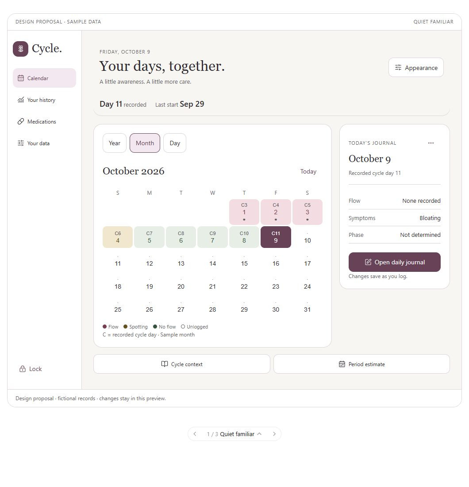
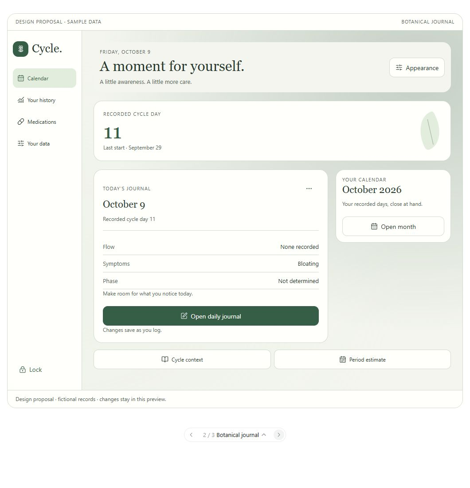
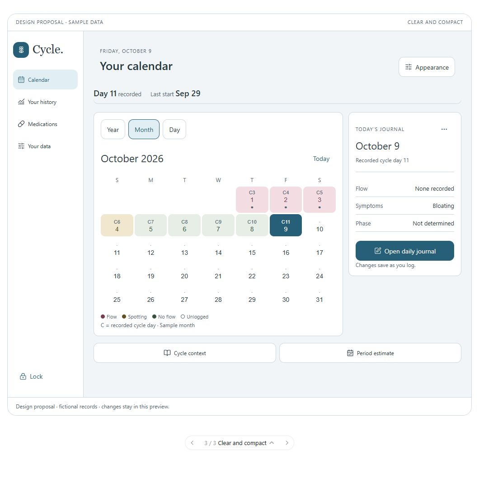

# Appearance proposal — October 9, 2026

**Status: presented for owner approval; not implemented in the app.** The app remains at preview 0.12.0. This review prepares the next appearance milestone without changing the working app or producing a new APK.

**Owner feedback:** the owner likes the initial proposals and requested six additional palettes: yellow, orange, lavender, pink, pastel blue, and light charcoal, with two generated built-in backgrounds for each. [Review the twelve named background candidates](backgrounds/README.md). The image set is awaiting review and has not been bundled into the app. A single final layout direction has not been explicitly selected in the owner's message.

The owner requested approval before beautification or customization is implemented. Choose one layout direction and approve the customization scope below, or request changes. Approval of a direction does not mean shipping all three layouts as a new user setting. The palette and background choices can be combined with any of the layouts.

## Three directions

| Direction                        | Proposed experience                                                                                                                                                             | Tradeoff                                                                                      |
| -------------------------------- | ------------------------------------------------------------------------------------------------------------------------------------------------------------------------------- | --------------------------------------------------------------------------------------------- |
| **Quiet familiar — recommended** | Keep the plum-and-cream identity, serif headings, month calendar first, compact recorded-cycle summary, and daily journal beside the calendar on desktop or below it on phones. | Closest to the tested app; daily details require scrolling below the month on a narrow phone. |
| **Botanical journal**            | A sage wash and small leaf decoration, daily journal first, month opened when needed. Desktop puts the entry on the left and calendar on the right.                             | More personal and quicker to reach the daily entry; seeing the month takes another tap.       |
| **Clear and compact**            | Sans-serif headings, less introductory copy, tighter spacing and smaller corner radii, with an ocean starting palette. Month calendar stays first.                              | More information focused, with less of the original journal feel.                             |

All three retain Calendar, Your history, Medications, and Your data. Desktop uses a sidebar; phones use bottom navigation. Appearance is available through Your data and a shortcut. Calendar, daily entry, history, medication, and settings examples show how the chosen direction would apply across the app.

Daily-entry removal stays in Entry options beside the date, with confirmation. It does not return to the bottom of the form. Logging, medication reminders, locking, reporting, and experimental prediction policy retain their established behavior. This proposal does not approve changing medical content or the meaning of recorded states.

## Customization scope for approval

| Option                   | Proposed scope                                                                                                                                                                                                                                                                             |
| ------------------------ | ------------------------------------------------------------------------------------------------------------------------------------------------------------------------------------------------------------------------------------------------------------------------------------------ |
| Palette                  | **Plum, Sage, Ocean.** The chosen layout's starting palette is the default; users can choose another.                                                                                                                                                                                      |
| Appearance               | **System, Light, Dark**, with System as the default.                                                                                                                                                                                                                                       |
| Background               | **Plain, Soft wash, Personal image.** Quiet familiar and Clear and compact start plain; Botanical journal starts with a subtle wash. The preview's “Image example” is an original abstract illustration standing in for a personal photo.                                                  |
| Background visibility    | **0–60%**, in 5-point steps, initially 25%. Text, records, controls, navigation, and important status information remain on opaque surfaces.                                                                                                                                               |
| Image choice and removal | Choose one image from the device, preview it before applying, replace or remove it, and offer **Reset appearance**. Use the platform's single-file/photo picker without broad library access. A centered cover crop is the initial proposal; advanced photo editing is outside this slice. |
| Storage                  | Appearance is local to each device/browser. A personal image appears only after unlock and is excluded from journal backups, CSV, and reports. Restoring a journal on another device does not transfer its background.                                                                     |
| Purchase model           | Included with the planned modest upfront purchase. No subscription, paid theme tier, or cosmetic upsell.                                                                                                                                                                                   |

Before implementing image storage, define size limits, supported formats, orientation handling, metadata removal, encryption consistent with the journal's privacy model, replacement/removal cleanup, and behavior when local storage is unavailable. Keep the image unavailable to the locked screen. These are implementation requirements, not functionality demonstrated by the mockup.

The selected theme must preserve the established meanings of flow, spotting, explicitly recorded no flow, and unlogged days. Keep text labels, accessible names, and selected-day details so color alone does not carry meaning. Appearance preferences must never alter records or calculations.

## Review material

The accompanying `appearance-proposals.html` is the versioned source of the interactive conversation preview. It is an HTML fragment intended for the visualization host, not an app route or standalone production page. It has no network requests and uses only fictional records. The host supplies the variant carousel, icons, and optional Computer/Phone preview control.

Open Appearance to try the palettes, modes, backgrounds, visibility slider, and reset. Calendar dates, daily-entry controls, and the four navigation sections are interactive samples. The photo picker and deeper app flows explain their proposed behavior; they do not access files or change the real journal. Preview preferences are separate from approval and do not authorize implementation.

### Quiet familiar

[Phone example](quiet-familiar-phone.png)

### Botanical journal

[Phone example](botanical-journal-phone.png)

### Clear and compact

[Phone example](clear-and-compact-phone.png) · [Dark appearance controls on a phone](appearance-dark-phone.png)

## Validation and next step

- Inspected all three directions in the browser, with desktop and phone screenshots. Checked browser widths of 1060, 393, and 320 pixels; the preview wrapper reduces the available content width further.
- Exercised calendar/day navigation, entry options, history, medications, palette/mode/background changes, keyboard adjustment of visibility, photo-picker explanation, reset, and carousel switching. Fixed a narrow-screen range-input overflow and removed the duplicate phone Appearance shortcut in the content header.
- Checked for horizontal overflow in the narrow calendar and appearance views and for browser errors/warnings. No remaining overflow or console errors were observed in those checks.
- JavaScript syntax and fragment checks passed. A calculation of the three palettes' core text/surface pairs in light and dark mode found a minimum contrast ratio of 5.62:1; this is not a complete accessibility audit.
- This is browser review of a design proposal. Native accessibility, larger system text, screen readers, personal photo import/storage, device performance, and Pixel 7 / Galaxy Z Flip5 usability still require implementation and real-device validation after approval. No new device pass is claimed.

After approval, record the chosen direction and options here, implement only that scope in the app, run the relevant checks and builds, and provide a new 0.x preview for device testing. Public 1.0 readiness remains a separate decision.

Source: [roadmap](../development-plan.md#planned-beautification-and-personal-appearance), [source review](../source-review-2026-10-09.md), screenshot 6 and comment `AAACIGIsKnU`.
