# Validation record

## 0.14.0 personal-photo backgrounds — October 10, 2026

The owner reported “Phone validations pass. Let's move forward” following 0.13.0. Recorded as an owner-reported phone-validation pass in the established Pixel 7 / Android 17 and Galaxy Z Flip5 context; individual checklist results, Flip5 OS details and timing measurements were not supplied. This authorizes the next approved appearance slice. The original proposal already covered choosing, previewing, applying, replacing and removing a personal image; no new layout direction was introduced.

- `pnpm check`: TypeScript and all **143 tests** passed. Eleven new tests cover PNG metadata/alpha preservation, JPEG metadata/multiple scans, malformed and bounded image inputs, exact base64 encoding, encryption with an independently derived key/fresh nonces, tampering/foreign keys, read/write/removal failures, replacement/reload, sample isolation, lock during reads/writes, and deletion ordered after pending saves. Existing journal/export tests remain green; journal content is still format 4.
- Formatting and Git whitespace checks passed. Final web, Android Hermes and iOS Hermes exports passed, using the existing pnpm-helper configuration and required Windows compiler execution access. The iOS result is a JavaScript bundle check, not a native iOS device build. Final web bundle: `index-715fccb8dd36b5004649799b19f543ad.js`; offline cache: `795acbaf374f4902`.
- Browser QA used only fictional sample data on isolated `127.0.0.1:4179`, synthetic PNG/JPEG fixtures, and an approved repository artwork file selected through the personal-file flow. The user's port-4173 journal was not accessed. Verified preview-before-apply, JPEG EXIF rotation (600 × 400 source displayed as 400 × 600), cancel preview, explicit cancellation while choosing, rejection of invalid/13 MiB files, replacement/removal, reset, switching to built-in artwork and reusing the saved photo, and sample exit with no personal image on the setup screen. System picker dismissal itself still needs device/browser regression; the automation chooser cannot submit an empty file list.
- A textured 1254 × 1254 PNG initially exceeded the storage cap even at 480 pixels. Added a 320-pixel fallback on both platforms; the same file then loaded at 320 × 320 with a 326,458-character data URI, safely under the 512 KiB binary cap. Original built-in artwork remains unchanged. Native and web builds were regenerated after this fix.
- Inspected 393 × 852, 320 × 740 and 1280 × 720 layouts, keyboard focus, light/dark surfaces and controls. Document dimensions matched the viewport with no page overflow. Screenshot below shows a repository artwork file used as a sample personal image, not a user's photo. The personal-photo panel uses the existing cards and approved centered cover behavior.
- After activating the final service worker, stopped the isolated server and opened the cached app. JPEG selection, preparation and Apply still worked; exiting the sample removed its image from the locked/setup screen. No captured browser warnings/errors in final online or offline checks. QA tabs were closed and the viewport override reset; the isolated server remains stopped.
- The final standalone ARM64 APK built successfully and passed signature verification and 16 KB alignment. Verified package `com.liambic.cycletracker.preview`, version **0.14.0**, code **17**, minimum API 24, target API 36, `allowBackup: false` and no debuggable flag. Permissions are unchanged from 0.13.0; the single-file picker adds no new broad library permission. Existing preview signing identity is unchanged. Confirmed the ImageManipulator native module in the APK's DEX, a 4,770,464-byte Hermes program, testing screenshots enabled, and the final native picker source matching the build cache.
- Native temporary-cache paths and orientation-loading code were inspected. Automated tests establish storage/crypto behavior and browser tests establish the web picker path; they do not establish native picker behavior, image orientation, temporary-file cleanup, memory use, TalkBack, folding, biometrics or restart retention for this new build. Those are the [0.14.0 phone checks](android-testing.md#0140-personal-photo-backgrounds). Independent security/accessibility review and native iOS validation remain release work.

Build artifacts, synthetic local QA files and signing material remain excluded from Git.

- File: `artifacts/android/cycle-tracker-preview-0.14.0-arm64-v8a.apk`.
- Size: **59,033,106 bytes**.
- APK SHA-256: `34efeb1eee9cdc7a8548f318d575b5f78d85cd84ff6fee3b3fbf7ea8b9dc6687`.
- Signing certificate SHA-256: `6e64159ed7656a5873b6f0379e74ef1c0a8bd6b1bbaba12e51cbd26355f75576`.

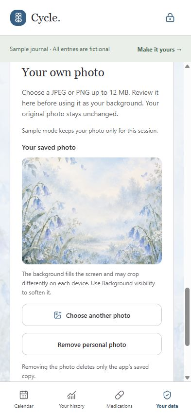

## 0.13.0 approved palettes and backgrounds — October 9, 2026

The owner approved all twelve generated images and six additional named palettes: “Looks good, these are approved.” Preview 0.13.0 implements nine palettes, System/Light/Dark, Plain/Soft wash/twelve bundled images, visibility, reset, and local appearance preferences. The existing navigation/layout remains; personal photos and further layout beautification are later work. This is still a development preview, with no 1.0 readiness claim.

- `pnpm check`: TypeScript and all **132 tests** passed. Eleven appearance tests cover persistence/reload/reset, separation from the encrypted journal key, temporary sample choices, sample entry during initial loading, corrupt/future settings, read/write failure and retry, ordered rapid writes, strict field validation, palette-independent flow colors, text contrast in all nine light/dark palettes, and integrity of all twelve bundled originals. Tested text/surface pairs meet 4.5:1; this is not a complete accessibility audit.
- `pnpm format:check` and Git whitespace checks passed. The local pnpm 11 helper was run with `--config.verify-deps-before-run=false` to avoid its automatic install/store-location mismatch; typechecking, tests and builds themselves were not skipped. Final web, Android Hermes and iOS Hermes exports passed. The initial sandboxed Hermes execution was denied by Windows; the export succeeded with the required execution access. iOS remains a JavaScript bundle check, not a native device build.
- Final web bundle: `index-070f07d47dcb479e7054dfba7e1817d4.js`; offline cache: `fd737d2085a55dc1`. Browser QA used only fictional sample data on isolated `127.0.0.1:4178`. The user's port-4173 journal was not accessed. All nine palette buttons and all twelve named background choices were exercised; every image loaded at its expected 1254 × 1254 intrinsic size.
- Inspected 1280 × 720 desktop, 393 × 852 phone, and 320 × 740 narrow layouts. An initial phone check exposed the image's intrinsic dimensions expanding the document. Explicit container-relative image dimensions and clipping fixed it; final checks found document width/height equal to the viewport, with no page overflow at these sizes. Internal calendar/history scrolling remains intentional.
- Checked Light/Dark/System selection, Plain/Soft wash/artwork, Home/End and arrow-key visibility adjustment (0, 5 and 60 percent), reset, pairing colors with another collection, calendar/day entry/modal, history charts, medication controls, education and experimental-estimate surfaces. Final status text also has opaque backing. Sample exit removes artwork from the lock/setup screen; re-entering starts from device defaults instead of the sample's previous choices. Native system appearance transitions, keyboards, TalkBack and Android Back remain device checks.
- Closed the QA tab to activate the final service worker, stopped the isolated server, and reopened the cached final bundle. All twelve backgrounds loaded and could be selected offline. No captured browser warnings/errors in the final online or offline sessions. Exited the sample, closed QA tabs, reset the viewport, and left the isolated server stopped.
- The final standalone ARM64 APK passed signature verification and 16 KB zip alignment. Verified package `com.liambic.cycletracker.preview`, version **0.13.0**, code **16**, minimum API 24, target API 36, no debuggable flag, and `allowBackup: false`. Embedded configuration has automatic appearance and testing screenshots enabled. The APK contains all twelve 1254 × 1254 background PNGs and a 4,736,056-byte Hermes program.
- Package size increases to **58,736,319 bytes** because the approved masters are bundled unchanged. No image-hosting service is introduced. Native first-use offline loading, theme persistence after restart, Android system appearance, Flip5 folding, larger text/TalkBack, and prior reminder/PDF/biometric/setup regressions remain [device checks](android-testing.md#0130-approved-palettes-and-backgrounds). No new hardware pass is claimed. Journal format, encryption and export formats are unchanged.

Build artifacts and signing material remain excluded from Git. Screenshots contain only the fictional sample journal.

- File: `artifacts/android/cycle-tracker-preview-0.13.0-arm64-v8a.apk`.
- APK SHA-256: `96b63ee0be5ead2412392dc819e181edadc81393028e08afc61dddd509f4c8a3`.
- Signing certificate SHA-256: `6e64159ed7656a5873b6f0379e74ef1c0a8bd6b1bbaba12e51cbd26355f75576`, unchanged from earlier previews.

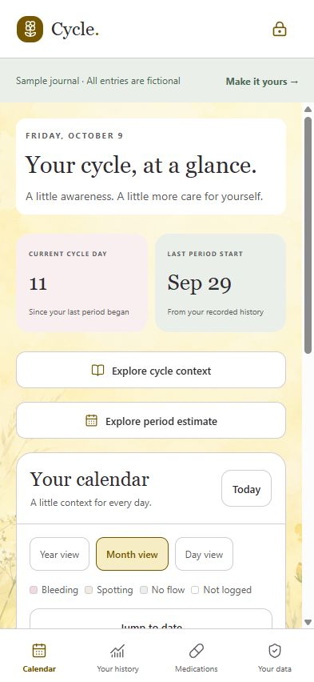

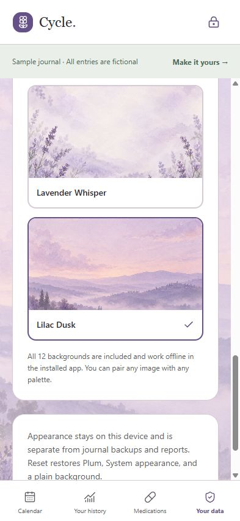

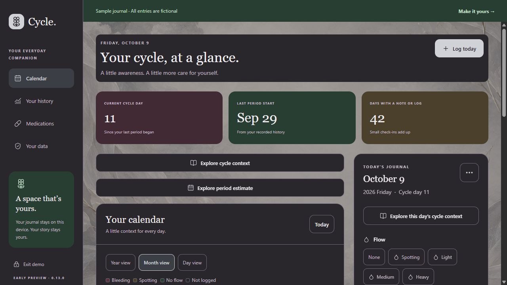

## 0.12.0 experimental period-start estimates — October 9, 2026

The owner approved continuing after 0.11.0. This slice adds an explicitly experimental, session-opt-in calculation from recorded starts, with context/completeness review, unavailable states, historical spread, and chronological earlier-entry checks. It does not establish clinical accuracy or finish all prediction work. Beautification/themes/backgrounds are next as an independent development slice.

- `pnpm check`: TypeScript and all **121 tests** passed. Fourteen new tests cover opt-in and all withholding contexts, exact start-to-start arithmetic, minimum history, recency boundary and latest-window selection, unusual intervals without trimming, variability and poor fit, future starts, expiry without roll-forward, start edits/removal, no target/future leakage, matching comparison folds and withheld folds, malformed inputs, leap/DST/calendar limits, sensitive-field independence, unchanged journal/CSV serialization, and the expanded fictional sample. An initial manually calculated expected test error was corrected from 2/3 to 1 day; the full suite passed afterward.
- `pnpm validate:estimates` produced the eight reproducible synthetic scenarios and comparison table in [the method record](period-estimates.md). Results include poor performance on trends and surprise gaps, plus complete withholding for one highly variable scenario. These test candidate calculation behavior, not clinical accuracy or full-policy population performance. The live earlier-entry check is also small-sample/retrospective. External-data and independent clinical/editorial validation remain pending.
- Final web, Android Hermes, and iOS Hermes exports passed. The final web bundle is `index-861feb7233c24a88acfde1765c4e5b4d.js`; offline cache `84ddb38277f39e22`. The final builds include a singular/plural copy correction. The only subsequent source adjustment was formatter whitespace. iOS remains a bundle check only. Formatting and Git whitespace checks passed.
- Browser QA used fictional data on isolated `127.0.0.1:4176`; no records on port 4173 were accessed. In sample mode, confirmed off-by-default, context and completeness gates, all four withholding choices, cleared confirmation after changing context, and the expected October 29 estimate anchored to September 29 with an October 28–29 historical spread. The sample's three earlier checks showed median/mean error 0.7 days, last-interval error 1.0, fixed-28 error 1.3, and 3/3 within the earlier spread.
- Confirmed Back to calendar and switching primary tabs discard answers; Log today exits into Day view. Turning estimates off and on resets context to unknown and removes confirmation. Opened calculation details; contributing intervals, baseline explanations, and all three holdout rows are accessible. Inspected 393 × 852, 320 × 740, and 1280 × 720 layouts and keyboard focus. These are browser observations, not TalkBack or native font-scaling/folding results.
- Unlocked the existing fictional format-4 vault with its original passphrase. Earlier note, two product records, clot/flooding summary, and three dose records remained. Its lack of period starts produced the seven-start requirement and 0/0 historical checks, with no date estimate even after session confirmation. No records were edited by these checks.
- After activating the updated service worker by closing the QA tab, stopped the isolated server and reloaded the final bundle. Sample mode, gates, estimate, and reset behavior worked offline. No captured errors or warnings in the final QA sessions. Exited sample mode, left the saved vault locked, closed the QA tabs, reset viewport, and stopped the isolated server.
- The standalone ARM64 release APK built successfully, passed signature verification and 16 KB zip alignment, and contains the unchanged preview signing certificate. Verified `com.liambic.cycletracker.preview`, version **0.12.0**, code **15**, minimum API 24, target API 36, notification/biometric permissions, `allowBackup: false`, no debuggable flag, and testing screenshots enabled. Embedded Hermes program: 4,701,008 bytes.
- Native update retention, Android Back, first-use airplane-mode calculation, TalkBack/large text/Flip5 folding, plus earlier reminder delivery, PDF sharing, and Flip5 setup checks remain in [the device guide](android-testing.md#0120-experimental-period-estimates). No new hardware pass is claimed. Journal format 4, encryption, passphrase, biometric credentials, and exports remain unchanged; review answers and estimates are never persisted.

Build artifacts and signing credentials remain outside Git. Screenshots show fictional sample data only.

- File: `artifacts/android/cycle-tracker-preview-0.12.0-arm64-v8a.apk` (33,474,890 bytes; excluded from Git).
- APK SHA-256: `d61a0e9774cf79ee6742357d5883675c91e86d4da574a139f7af1c7cfd0e24a3`.
- Signing certificate SHA-256: `6e64159ed7656a5873b6f0379e74ef1c0a8bd6b1bbaba12e51cbd26355f75576`, unchanged from earlier previews.

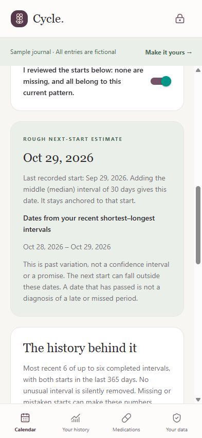

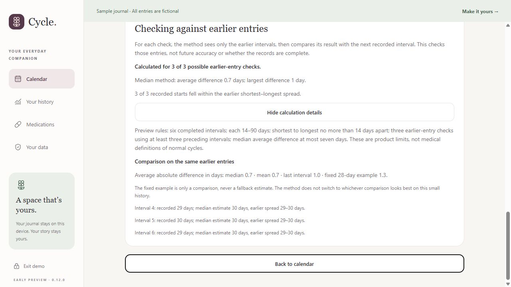

## 0.11.0 recorded cycle context and education — October 9, 2026

The owner requested continued preview development. This implements the educational portion of milestone 5: recorded daily context and nine manually browsable topics. Personal period/ovulation predictions remain separate upcoming work, and 1.0 still requires an explicit readiness decision.

- `pnpm check`: TypeScript and all **107 tests** passed. Nine new tests cover missing starts, historical start boundaries and inclusive counts, leap/DST arithmetic, long gaps and sensitive-field exclusion, future imported entries, all recorded flow choices versus unknown, clearing a start without losing other fields, perimenopause filtering, and static source-link completeness. Symptoms and elapsed time never establish a personal phase. The only subsequent code change clarified the settings description; final production exports include it.
- Final production web, Android Hermes, and iOS Hermes exports passed. The final web bundle is `index-d3cea291627ab128dbb746800494edab.js`, and the offline cache version is `96c62905b7ced2ba`. iOS remains a bundle check only. Formatting and Git whitespace checks passed.
- Browser QA used fictional records on isolated `127.0.0.1:4176`, without accessing user storage on port 4173. Verified full calendar context, Month-view sheet and Day-view return paths, preserved selected dates, sample recorded cycle day 11 / elapsed 10, a past explicit No-flow day, a future date with no projected cycle day, and the existing fictional vault's no-start/unknown-flow state. Earlier notes, product/observation summaries, and three dose records remained available after unlocking.
- Browsed all nine topics and their headings; checked first/last navigation boundaries and selected-topic state. Turning off perimenopause visibility in sample mode left eight topics and retained the general medication topic. Inspected 393 × 852, 320 × 740, and 1280 × 720 layouts, including the longer hormonal-medicines card, wrapped controls, readable sources, and keyboard focus on a source link. These are browser checks, not native font-scaling or screen-reader validation.
- The NHS PMS link opened the exact public URL without query parameters in a separate tab. The bundled copy was checked against the seven official sources listed in [the education notes](cycle-education.md); this is developer source checking, not independent clinical approval. No journal data selects topics or enters source URLs.
- Stopped the isolated server and reloaded the final bundle, unlocked the existing fictional journal, and browsed context and education successfully. An initial offline reload used the previous service worker while an old tab remained open; loading online and closing all app tabs allowed the waiting update to activate. The final offline pass retained the new bundle and preview 0.11.0. This normal browser-update step is now documented in the README. No captured errors or warnings occurred in the final QA tab.
- The standalone ARM64 release APK passed signature verification and 16 KB zip alignment. Verified `com.liambic.cycletracker.preview`, version **0.11.0**, code **14**, minimum API 24, target API 36, notification/biometric permissions, `allowBackup: false`, and no debuggable flag. Embedded configuration keeps testing screenshots enabled; the Hermes program is 4,685,988 bytes.
- Real-phone update retention, context navigation/Android Back, airplane-mode reading and source return, TalkBack/large text/Flip5 folding, plus earlier reminder delivery, PDF sharing, and Flip5 setup checks remain in [the device guide](android-testing.md#0110-daily-context-and-education). No new hardware pass is claimed. Journal format 4, encrypted envelope, passphrase, and biometric credentials remain unchanged.

The fictional vault was left locked, the temporary tabs closed, viewport reset, and isolated server stopped. Build outputs and signing material remain outside Git. Screenshots contain only the fictional sample journal.

- File: `artifacts/android/cycle-tracker-preview-0.11.0-arm64-v8a.apk` (33,459,870 bytes; excluded from Git).
- APK SHA-256: `a1426dfd3b717c1c367f50052e46abf5b5eb930c62aeadb3058ea21c7a3d3eba`.
- Signing certificate SHA-256: `6e64159ed7656a5873b6f0379e74ef1c0a8bd6b1bbaba12e51cbd26355f75576`, unchanged from earlier previews.

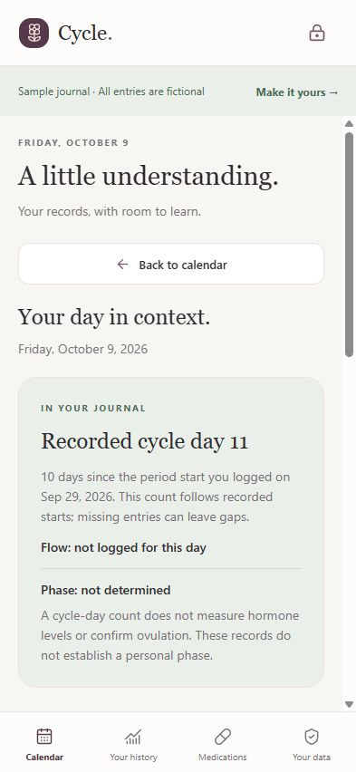

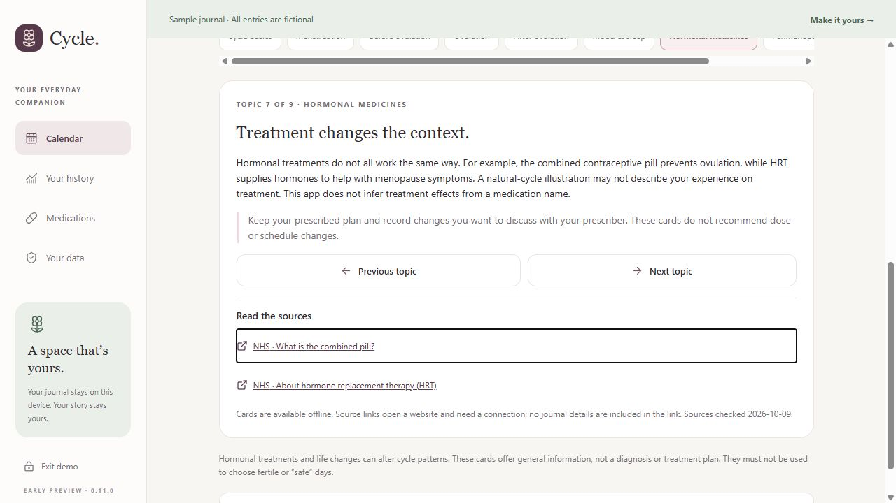

## 0.10.0 doctor summaries and PDFs — October 9, 2026

The owner approved continuing preview development after confirming that the next milestone would not trigger 1.0. This slice implements the source document's configurable doctor report request. Release readiness remains a separate explicit decision, and beautification/themes/backgrounds remain on the roadmap.

- `pnpm check`: TypeScript and all **98 tests** passed. Thirteen report tests cover fresh privacy defaults, valid/bounded dates and strict section choices, in-range cycle boundaries, unknown flow versus No, mood/symptom separation and zero severity, all 16 sexual-field combinations and excluded-only dates, overlapping medication versions and note controls, historical dose snapshots, filtered snapshot independence, report size limits, actual-font pagination and long tokens, real PDF parsing and absence of active content, and unsupported glyph errors without journal changes.
- Production web, Android Hermes, and iOS Hermes exports passed. Initial browser execution caught a `tslib` 1.x export-wrapper interoperability error despite successful builds/tests. Added a scoped Metro resolver fallback and copied that configuration into the native build cache; rebuilt all platforms. The final browser bundle is `index-ef568f7ef21972b6eac8a4f1757c6632.js`. No new captured console errors occurred after that fix. iOS is a bundle check only.
- Browser QA at isolated `127.0.0.1:4176` unlocked the existing fictional format-4 journal. Verified mobile 393 × 852 and desktop 1280 × 720 layouts, initial notes/sexual-health exclusions, rejection of a reversed range, report preview, independent Libido inclusion preserving None/High, and resetting report choices by leaving/reopening. The original journal remained available with its schedules, products, observations, notes, and dose records. No user records from port 4173 were accessed.
- Actual browser downloads were parsed with pypdf: a default two-page PDF (21,997 bytes) and a Libido-enabled three-page PDF (22,712 bytes). Both preserved product quantities/amounts, Flooding No, Taken late/Skipped/as-needed outcomes, and unknown actual time. Excluded notes, activity/orgasm values, and the future medication dose change were absent; only the opted-in PDF contained Libido/None/High. Rendered and visually inspected all five pages for wrapping, spacing, footer numbers, and clipping. A separate browser sample export identified fictional data on every page.
- Generated an additional six-page stress report using the app renderer and fictional sample data with accented text, blank lines, and long unbroken notes. Rendered and visually inspected every page; no clipping or overlaps. Automated checks bound every rendered line and confirmed Letter page size, embedded fonts, no JavaScript/attachments/actions, and readable unencrypted output. PDFs are not yet tagged; broader script/emoji support and accessibility review remain pending.
- A native ARM64 release APK built and passed signature verification and 16 KB zip alignment. Verified `com.liambic.cycletracker.preview`, version **0.10.0**, code **13**, minimum API 24, target API 36, notification/biometric permissions, `allowBackup: false`, and no debuggable flag. Embedded configuration keeps testing screenshots enabled. The Hermes program is 4,671,564 bytes; both regular (569,208 bytes) and bold (575,740 bytes) TTF fonts are present in the APK.
- Phone export/share/cancel behavior, first export offline, cache cleanup after native process termination, TalkBack/large text/folding, update retention, reminder delivery, and earlier Flip5 creation regressions remain in [the device guide](android-testing.md#0100-doctor-summaries-and-pdf-export). No new hardware test pass is claimed. Journal format 4 and the encrypted envelope/passphrase/biometric credentials remain unchanged.

Build outputs, test PDFs, and signing material stay outside Git. The test vault was locked after QA; the temporary browser tab and isolated server were closed and viewport reset.

- File: `artifacts/android/cycle-tracker-preview-0.10.0-arm64-v8a.apk` (33,445,446 bytes; excluded from Git).
- APK SHA-256: `e7ffb1f905f112c2c38b1029257dbed197b01fb3f50ef776fa97602ef40c9473`.
- Signing certificate SHA-256: `6e64159ed7656a5873b6f0379e74ef1c0a8bd6b1bbaba12e51cbd26355f75576`, unchanged from earlier previews.

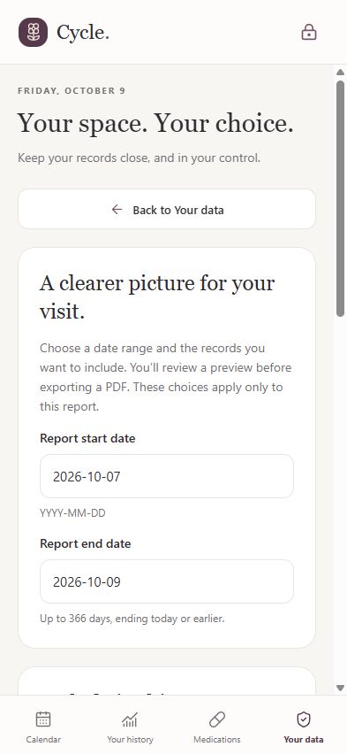

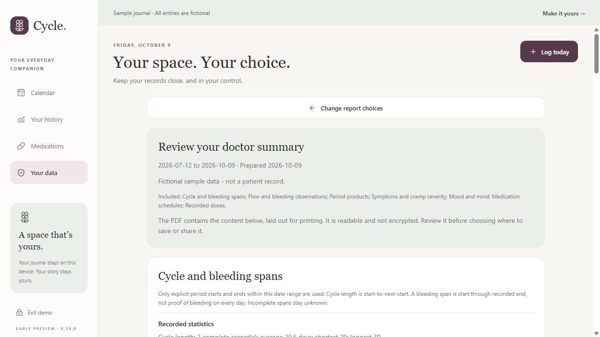

## 0.9.0 medication reminders — October 9, 2026

The owner requested completing medication reminders and explicitly tracking beautification, background images, and color themes from the source document. Reminder implementation is complete for this preview; actual phone delivery is still unverified. The appearance work is now a dedicated roadmap section tied to screenshot 6 / comment `AAACIGIsKnU`, not a claim of implemented customization.

- Final `pnpm check`: strict TypeScript and all **85 tests** passed. Nineteen reminder tests cover opt-in/privacy, future-only scheduling, daily/weekday/on-off/placebo/PRN/pause behavior, dated changes, recorded-dose suppression and restoration, shared timestamps, queue bounds, DST gaps/overlaps, time-zone changes, permission denial/revocation, durable device preferences, schedule replacement, serialized cancellation, vault replacement/corrupt preferences, native/storage failures, test delivery requests, browser isolation, and rearming stable identifiers after a force-stop. These use a fake native backend and do not establish OS delivery.
- Final `pnpm build:all`: web, Android Hermes, and iOS Hermes exports passed. The final save-failure guard is included: automatic refresh requires the current revision to have saved, and a failed save cannot trigger reminder scheduling through an error-recovery path. iOS remains a bundle check, not a native build/device result.
- Browser QA used only the existing fictional journal on isolated `127.0.0.1:4176`. Inspected 393 × 852 and 1280 × 720 layouts, reminder explanation, accessible medication-specific switches (disabled in a browser), and preview 0.9.0. No notification prompt or native test controls appeared. Existing three medication definitions, future schedule version, product/bleeding observations, sexual-health summary, note, and Taken late/Skipped/as-needed dose records remained available.
- Locked and reloaded the final production export, confirmed the final script bundle in the page DOM, and unlocked the fictional journal successfully. Sample mode retained its own definitions and disabled reminder switches. No captured browser console errors. Left the vault locked, closed the QA tab, reset the viewport, and stopped the isolated server. User storage on port 4173 was not used. Screenshots below show browser layout only; they are not evidence of native permission UI or notification delivery.
- Formatting and diff whitespace checks passed. No real records, exported journals, signing credentials, build cache, or APKs enter Git. Journal format 4, encrypted envelope, passphrase, and biometric key remain unchanged. Device reminder opt-ins are not exported and reset on restore.
- Native permission prompts and channel blocking, actual test/dose delivery and delays, locked/terminated/reboot behavior, cancellation, timezone travel, update retention, backup replacement/deletion, TalkBack/large text, and Flip5 folding remain [0.9.0 hardware checks](android-testing.md#090-medication-reminders). Earlier Flip5 setup/screenshot/passphrase checks also remain pending. No new owner hardware pass was supplied.

The Android queue is intentionally inexact on Android 12+ without special alarm access; battery/notification settings can delay alerts. Both native platforms use a bounded 30-day / 60-dose-time queue plus a refresh notice and optional test. The visible renewal deadline requires unlocking to continue reminders; this preview does not promise indefinite scheduling while the journal remains locked.

The final standalone ARM64 release APK built successfully and passed signature verification and 16 KB zip alignment. Package `com.liambic.cycletracker.preview`, version **0.9.0**, code **12**, minimum API 24, target API 36, `POST_NOTIFICATIONS`, `RECEIVE_BOOT_COMPLETED`, `USE_BIOMETRIC`, native notification receiver, `allowBackup: false`, and no debuggable flag were verified. No `SCHEDULE_EXACT_ALARM` permission is declared. Embedded configuration confirms preview screenshots remain enabled; the Hermes program is 3,292,428 bytes.

- File: `artifacts/android/cycle-tracker-preview-0.9.0-arm64-v8a.apk` (31,497,314 bytes; excluded from Git).
- APK SHA-256: `d5a5c474f388ec9fc8aba91da2f4257113dafee0eb39851984e2b7cafa497dd6`.
- Signing certificate SHA-256: `6e64159ed7656a5873b6f0379e74ef1c0a8bd6b1bbaba12e51cbd26355f75576`, unchanged from earlier previews.

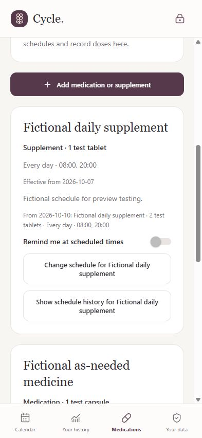

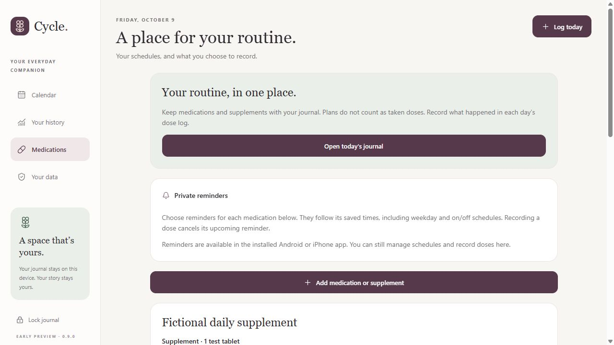

## 0.8.0 medication schedules and dose records — October 9, 2026

The owner requested moving to the next milestone after 0.7.0. This implements the medication recording foundation: definitions, daily/weekday/on-off/as-needed schedules, optional user-entered placebo labels, dated changes and pauses, daily outcomes and notes, and complete backups/exports. Notifications and doctor PDFs remain separate planned work. This request does not supply a new hardware test result.

- `pnpm check`: strict TypeScript and all **66 tests** passed. Eleven new tests cover version 1–3 migration, bounded/strict schedule validation, identity/time/date errors, daily/weekday/start/pause boundaries, on/off repetition across leap days and DST, optional off-day labels, immutable dated changes, protection of existing dose records, duplicate/stale/future dose rejection, overnight actual dates, independent as-needed events, outcome validation, deletion/Undo, encrypted snapshots, and readable export completeness/formula escaping. The final compatibility adjustment to plan lookup passed the focused eleven-test suite; the final dose-card layout passed TypeScript.
- Final `pnpm build:all` passed for web, Android Hermes, and iOS Hermes. The Android preview APK was rebuilt after the final readability changes. iOS remains a bundle check only; no IPA/device run is claimed. Formatting and Git whitespace checks passed.
- Browser QA used isolated `127.0.0.1:4176` with a previously saved fictional version 3 vault. It opened with the existing passphrase and an empty medication list. Earlier note, products, bleeding observations, and sexual-health records remained. In the 393 × 852 layout, added a backdated fictional daily supplement with two times; `25:00` was rejected, valid times saved, and a canceled named draft added nothing. Added a separate as-needed definition.
- In phone Day view and the Month-view sheet, a new dose had no status selected; Save rejected it until an outcome was chosen. Recorded a Taken dose with time and note, edited it to Taken late, canceled removal, then removed and restored it with Undo. It appeared once, and the scheduled slot returned only while it was removed. Added a Skipped dose without actual amount/time and an as-needed Taken record with unknown time and reason. Final cards separate status, planned amount, recorded amount/date/time, and note for scanning.
- After dose records existed, a schedule change suggested the following day. Trying the recorded date was rejected. A later dose-label change saved while today's label and snapshots stayed unchanged; history displayed both dated versions. Added a fictional two-on/one-off pack with an explicit placebo label. October 9 displayed its off-day label; October 8 displayed its on-day label. This is fictional schedule-entry QA, not a dosing recommendation.
- Inspected the medication tab and daily side panel at 1280 × 720. Locked, reloaded, and unlocked the final build: definitions, future change, selected date, and all three recorded dose outcomes persisted with earlier journal fields. The separate sample journal showed its own two fictional definitions, with no QA-vault entries. No captured browser console errors. Exited sample mode, left the vault locked, closed the QA tab, reset the viewport, and stopped the isolated server. User storage on port 4173 was not used.
- Inspected actual downloaded CSVs: daily export included complete Taken late/Skipped/as-needed records and notes, did not manufacture missed-dose rows, preserved product records, and left sexual-health columns off. The separate schedule CSV included all four plan versions, the future transition boundary, on/off/placebo label, times, and notes. Downloaded an encrypted backup through the UI and decrypted it with the fictional test passphrase in a local verification script: content version 4, three medications, the dated change, three dose records, older products, and excluded-from-CSV sexual-health data all survived. No export, passphrase, or decrypted journal was committed.
- Native update retention, keyboard/TalkBack/large text, fold/rotation, sharing/restore, and biometric behavior remain [0.8.0 device checks](android-testing.md#080-medication-schedules-and-dose-records). Earlier Flip5 creation and screenshot/eye-control retests remain pending. No notification delivery was tested because this version does not implement reminders.

The final standalone ARM64 release APK passed signature verification and 16 KB zip alignment. Package identity is `com.liambic.cycletracker.preview`, version **0.8.0**, version code **11**, minimum API 24, target API 36, `USE_BIOMETRIC`, `allowBackup: false`, and no debuggable flag. Embedded configuration confirms testing screenshots remain enabled. The bundled Hermes program is 3,186,464 bytes.

- File: `artifacts/android/cycle-tracker-preview-0.8.0-arm64-v8a.apk` (29,990,898 bytes; excluded from Git).
- APK SHA-256: `884b7f91246bd8e93854ea0926c0b86c0a3d38b5074b22a0069722826095816e`.
- Signing certificate SHA-256: `6e64159ed7656a5873b6f0379e74ef1c0a8bd6b1bbaba12e51cbd26355f75576`, unchanged from earlier previews.

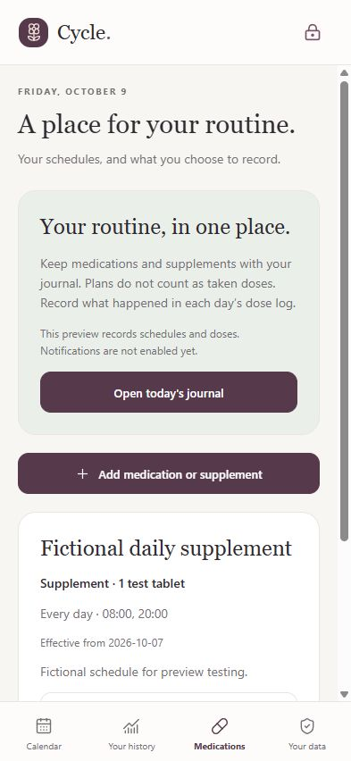

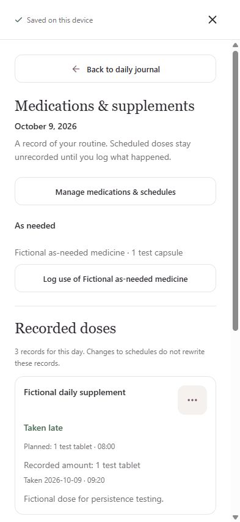

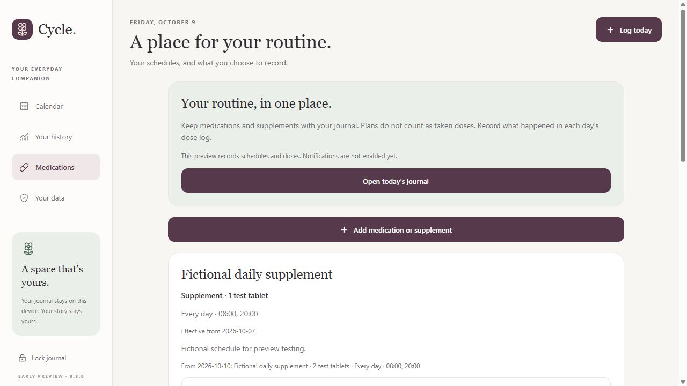

## 0.7.0 flooding explanation and sexual-health records — October 9, 2026

The owner requested adding the approved flooding definition and moving to the next development step. This preview adds the visible definition, optional independent sexual-health fields, and individual CSV inclusion choices. It does not record a new device test pass. Medication/supplement definitions, schedules, and dose logging are next; PDF report configuration remains later work.

- `pnpm check`: strict TypeScript and all **55 tests** passed. Seven new tests cover version 1/2 migration, malformed and future-version rejection, explicit No/None versus unlogged values, independent clearing and lack of flow/cycle inference, immutable deletion/Undo, encrypted full-data round trips, all 16 CSV inclusion combinations, excluded-only date omission, formula-prefix neutralization, and the intentional inclusion of free-text notes/symptoms. Existing biometric, key-derivation, persistence, product, symptom, and history tests still pass.
- `pnpm build:all`: web, Android Hermes, and iOS Hermes production exports passed. The iOS result is a bundle check only. The standalone Android ARM64 release APK also built successfully.
- Browser QA used isolated `127.0.0.1:4176` and only fictional records. The existing version 2 QA vault opened with its original passphrase, note, two product records, Clots Yes, and Flooding No intact. All four new fields initially showed Not logged. At 393 × 852, inspected the visible flooding definition and optional editor in Month view's sheet. Recorded Yes/Gentle/No/High; clearing only intensity retained the other three. The daily summary displayed only that details were logged.
- Added a separate libido-only date with explicit None. Inspected the default export screen, enabled only Libido, canceled, and reopened: all four switches reset off. Two actual downloaded CSVs were inspected. The default retained the original eleven columns and omitted the libido-only date. The Libido-only export appended just that column, included the extra date with None, retained High on the other date, and left unlogged libido blank. Original note and product records were unchanged. The browser download-event listener timed out, but the downloads completed; the resulting local files were read directly to verify their contents.
- Locked, reloaded, and unlocked the fictional journal. Activity Yes, intensity unlogged, orgasm No, libido High, the separate None-only date, old notes/products, and selected date persisted. Inspected phone Day view and wrapped choices, plus the desktop side panel at 1280 × 720. No captured browser console errors. Locked the fictional vault, closed the QA tab, reset the viewport, and stopped the isolated server afterward. User storage on port 4173 was not used.
- Encrypted migration/round-trip fidelity and complete Undo were exercised in domain/storage tests. Native file sharing and backup transfer, TalkBack, large text, keyboard, folding, rotation, and biometric regression remain [0.7.0 device checks](android-testing.md#070-flooding-explanation-and-sexual-health-records). The earlier Flip5 setup retest remains pending.
- Content version 3 accepts versions 1/2 with unlogged defaults. New backups require 0.7.0+; envelope version 1, KDF, passphrase, and biometric key are unchanged. The approved flooding copy is grounded in the NHS sources linked in [architecture notes](architecture.md#flooding-explanation-and-sexual-health-records-070), not an independent clinical review.

APK signature verification and 16 KB zip alignment passed. Package identity is `com.liambic.cycletracker.preview`, version **0.7.0**, version code **10**, minimum API 24, target API 36, `USE_BIOMETRIC`, `allowBackup: false`, and no debuggable flag. Embedded configuration confirms testing screenshots remain enabled. The bundled Hermes program is 3,149,508 bytes.

- File: `artifacts/android/cycle-tracker-preview-0.7.0-arm64-v8a.apk` (29,953,938 bytes; excluded from Git).
- APK SHA-256: `238e7f0a0914ecbfcc0278a655e464ccff20667d2531d92b14cb957e0d09c757`.
- Signing certificate SHA-256: `6e64159ed7656a5873b6f0379e74ef1c0a8bd6b1bbaba12e51cbd26355f75576`, unchanged from earlier previews.

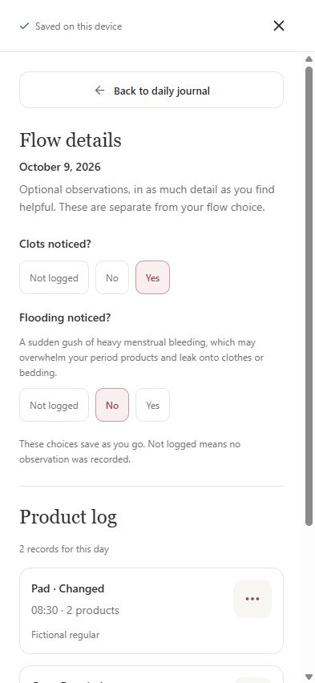

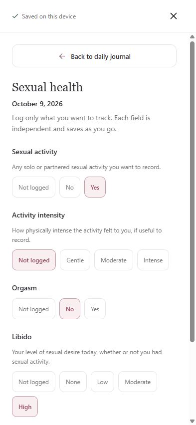

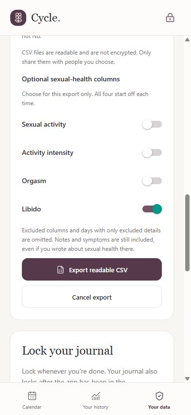

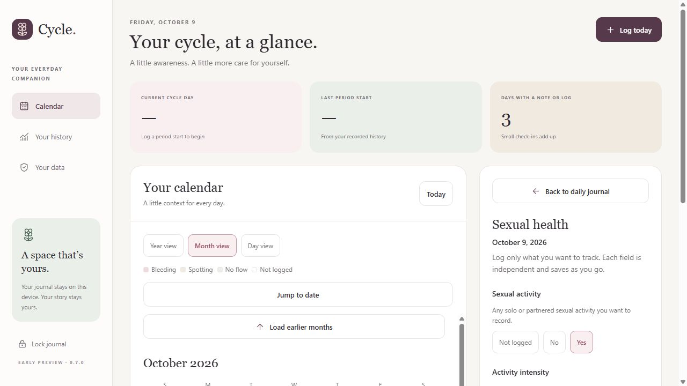

## 0.6.0 product records and bleeding observations — October 9, 2026

The owner approved the 0.5.3 layout and explicitly requested continuing. That is authorization to proceed, not another device-specific test report. This slice adds optional product records and daily clot/flooding observations. Sexual-health records and clinical interpretation remain separate later work.

- `pnpm check`: strict TypeScript and all **48 tests** passed. Eight new tests cover legacy migration/defaults, strict record validation and limits, form number/time parsing, explicit No versus unknown observations, independence from flow/cycle markers, immutable edits and duplicate/stale IDs, complete entry deletion/Undo, encrypted round trips with the unchanged envelope/key, and CSV completeness/quoting. Existing biometric, key-derivation, ordered-write, history, and symptom tests still pass.
- `pnpm build:all`: web, Android Hermes, and iOS Hermes production exports passed. The iOS result is a bundle check, not an IPA or device run. The only final code adjustment after browser QA tightened sub-centesimal imported mL rejection; the full test suite and all bundles were rerun afterward.
- Browser QA at isolated `127.0.0.1:4176` opened the previously created 0.5.2/0.5.3 fictional vault. Its note remained, while product records were empty and clot/flooding observations were unlogged. In the 393 × 852 Month-view daily sheet, selected Clots Yes / Flooding No and added a pad change. Zero quantity and `25:00` were rejected without adding a record; quantity 2 / `08:30` saved correctly.
- Added a cup emptying using decimal-comma `12,5` mL and an earlier time; it sorted before the pad. Editing to a later time and 0 mL kept one record and displayed explicit zero. Removal cancellation kept both records; confirming removal exposed Undo, which restored the complete cup record. Canceling an underwear draft added nothing. Resetting an observation to Not logged worked without changing the other details.
- Clearing a logged flow choice retained both product records and observations. Restored the fictional cup amount to 12.5 mL, locked, reloaded, and unlocked: product type/action/count/time/amount, observations, and the original note persisted. Inspected the product form in the 1280 × 720 desktop side panel and records in phone Day view. Moving to the prior day showed a separate empty log and unlogged observations. Added an untimed underwear change there; it displayed **Time not logged**, without inheriting today's time.
- No captured browser console errors. The fictional vault was locked, QA tab closed, viewport reset, and isolated server stopped. Screenshots below contain only invented test data. Whole-entry Undo, encrypted export/import fidelity, and CSV quoting were exercised in domain/storage tests; native sharing, actual backup transfer between phones, TalkBack, fold/rotation, and keyboard behavior remain [device checks](android-testing.md#060-product-records-and-bleeding-observations).
- Journal content is version 2; version 1 imports remain supported and gain unlogged defaults. Older apps reject version 2 instead of dropping the new data. Update a receiving app before restoring a new backup. The vault envelope, key derivation, passphrase, and biometric credential format remain unchanged. The earlier Flip5 creation retest and native screenshot/eye-control checks remain pending.

The standalone ARM64 release APK built successfully. Signature verification and 16 KB zip alignment passed. Package identity is `com.liambic.cycletracker.preview`, version **0.6.0**, version code **9**, minimum API 24, target API 36, `USE_BIOMETRIC`, `allowBackup: false`, and no debuggable flag. Embedded configuration confirms testing screenshots remain enabled. The bundled Hermes program is 3,141,668 bytes.

- File: `artifacts/android/cycle-tracker-preview-0.6.0-arm64-v8a.apk` (29,946,098 bytes; excluded from Git).
- APK SHA-256: `0675d3756bc5f30612c2cf749afcafcef0aafb39405f055cb1a7684a0624232e`.
- Signing certificate SHA-256: `6e64159ed7656a5873b6f0379e74ef1c0a8bd6b1bbaba12e51cbd26355f75576`, unchanged from earlier previews.

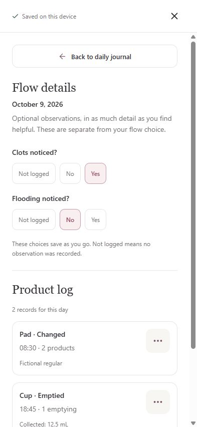

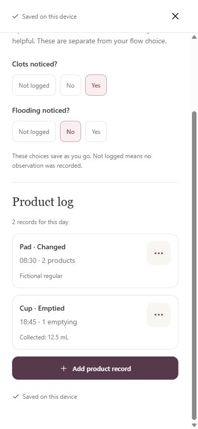

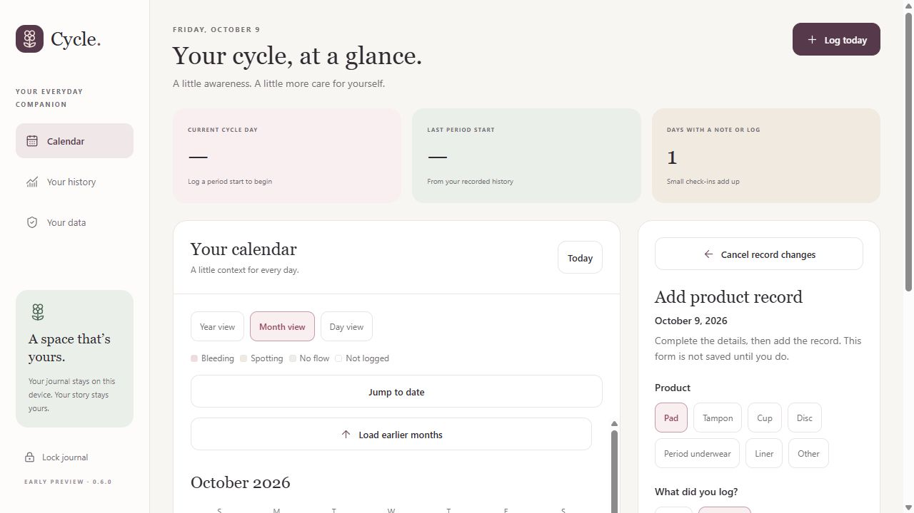

## 0.5.3 entry options and autosave — October 9, 2026

The owner identified the bottom-of-entry Delete button as easy to confuse with Save. Deletion now sits behind **Entry options** beside the date and a separate dated confirmation. **Keep entry** is the prominent confirmation action; destructive controls have red outlines. Undo appears near the date after deletion. The footer explains autosave and displays the actual journal save state, or clearly identifies session-only sample changes. Screenshot availability, passphrase eyes, cryptography, and deletion/Undo storage rules are unchanged.

- Strict TypeScript and all **40 existing tests** passed, including complete-entry deletion/Undo and failed-write recovery. These are the commands from `pnpm check`, run directly after the local pnpm wrapper attempted an unnecessary noninteractive modules refresh. The final accessibility adjustment also passed TypeScript. Web, Android Hermes, and iOS Hermes production exports passed using the installed compiler outside the execution sandbox.
- Browser QA used isolated `127.0.0.1:4176`, fictional sample data, and the previously created fictional QA vault. At 393 × 852, Month view’s daily sheet initially had no visible Delete button. Entry options exposed Delete; Keep entry closed confirmation without changing the selected symptom. Confirming deletion removed the sample entry and immediately offered Undo near the header; Undo restored the symptom. At 1280 × 720, visually checked the same options panel beside the entry date in the desktop side panel.
- An empty saved-journal day had no options control. Entering a fictional note made Entry options available without exposing Delete, and the footer showed **Changes save automatically** / **Saved on this device**. The note survived locking, page reload, and passphrase unlock. Checked the footer in phone Day view; sample mode instead described session-only changes.
- The final web build exposes `aria-expanded=false/true` when toggling options. Opening the symptom browser cleared pending confirmation; returning left options closed. Changing dates also reset confirmation, and empty/future dates had no deletion action. No captured browser console errors. Locked the fictional vault, closed the QA tab, reset the viewport, and stopped the isolated server afterward.
- Actual Android input, TalkBack, large text, fold/reopen, and update retention remain [0.5.3 device checks](android-testing.md#053-entry-options-and-autosave). The earlier Flip5 creation retest and native screenshot/passphrase-eye checks remain pending; this feedback is not a hardware pass.

The final standalone ARM64 release APK built successfully. Signature verification, 16 KB zip alignment, formatting, and Git whitespace checks passed. Package identity remains `com.liambic.cycletracker.preview`, version **0.5.3**, version code **8**, minimum API 24, target API 36, `USE_BIOMETRIC`, `allowBackup: false`, and no debuggable flag. Embedded configuration confirms testing screenshots remain enabled. The bundled Hermes program is 3,124,060 bytes.

- File: `artifacts/android/cycle-tracker-preview-0.5.3-arm64-v8a.apk` (29,928,486 bytes; excluded from Git).
- APK SHA-256: `ea7fb83e4f3113941dbd7d6cf5a2b297c115dfee4d818b88ef9e16a543729b66`.
- Signing certificate SHA-256: `6e64159ed7656a5873b6f0379e74ef1c0a8bd6b1bbaba12e51cbd26355f75576`, unchanged from earlier previews.

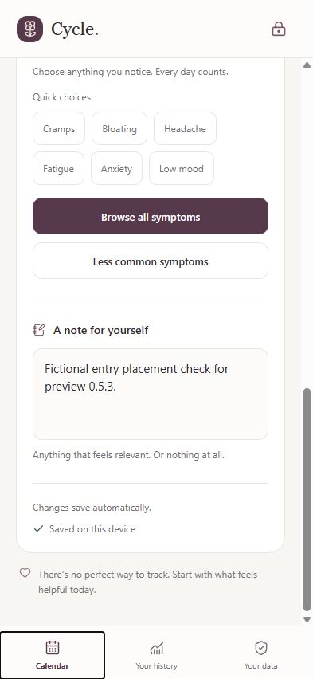

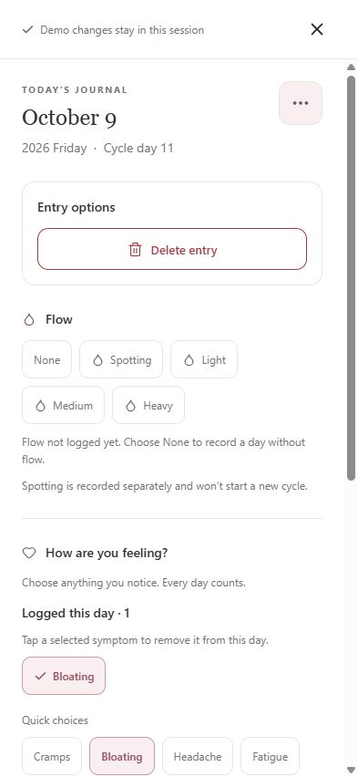

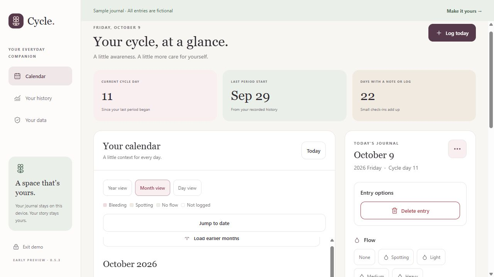

## 0.5.2 testing screenshots and passphrase visibility — October 9, 2026

At the owner's request, testing previews now allow screenshots, and setup/confirmation/unlock/restore passphrase fields have independent show/hide eye controls. Store/default builds retain capture protection. Android preview Recents secure-window blanking is also off; the existing background overlay and lock remain, and iOS retains its separate app-switcher blur. Settings text reflects the preview behavior. The 0.5.1 native passphrase fix remains included; no Flip5 success report has been received yet.

- `pnpm check`: strict TypeScript and all **40 existing tests** passed. Web, Android Hermes, and iOS Hermes production exports passed. No encryption, vault schema, or biometric changes were made.
- Executed configuration checks for an absent variant, production, and preview, including an incoming extra flag set to true. Only preview retained `allowPreviewScreenshots: true`; default/production explicitly set false. The final APK's embedded `assets/app.config` confirms the preview flag is true and the package is the preview identity.
- At 393 × 852 and 1280 × 720 on isolated `127.0.0.1:4176`, inspected the two setup fields and eye targets. Both start masked. Showing one leaves the other hidden; hiding it and showing confirmation preserves the entered fictional text. The accessibility tree exposes Show/Hide labels and pressed state.
- Created a fictional journal after toggling visibility, then locked it. An incorrect revealed passphrase was rejected and the form returned to a cleared, masked field. Showing/hiding the correct passphrase still unlocked the journal. No captured console errors. The fictional journal was locked, test tab closed, viewport reset, and server stopped. The screenshot below uses test-only text.
- Actual native screenshots, secure-text keyboard/cursor behavior, TalkBack, background reset, restore-field interaction, and biometric regression remain [0.5.2 device checks](android-testing.md#052-screenshots-and-passphrase-controls). Browser tests and configuration inspection do not establish a hardware pass.

The standalone ARM64 release APK built successfully. Signature verification, 16 KB zip alignment, Prettier, and Git whitespace checks passed. The certificate matches previous previews. Package identity is `com.liambic.cycletracker.preview`, version **0.5.2**, version code **7**, minimum API 24, target API 36, `USE_BIOMETRIC`, `allowBackup: false`, and no debuggable flag. The bundled Hermes program is 3,123,008 bytes.

- File: `artifacts/android/cycle-tracker-preview-0.5.2-arm64-v8a.apk` (29,927,434 bytes; excluded from Git).
- APK SHA-256: `8df5a6aac02a712cd7c66319efee279cde445acbb9dce561daae5be34911200d`.
- Signing certificate SHA-256: `6e64159ed7656a5873b6f0379e74ef1c0a8bd6b1bbaba12e51cbd26355f75576`.

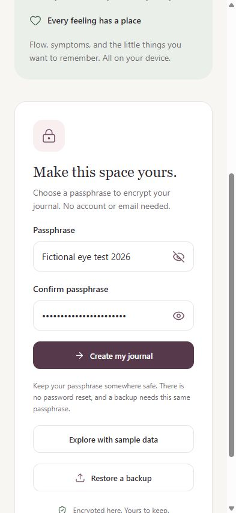

## 0.5.0 Flip5 creation failure / 0.5.1 fix — October 9, 2026

The owner reported **Galaxy Z Flip5, preview 0.5.0, over a minute** on the Create my journal spinner. Android/One UI versions were not supplied. No phone was connected to ADB, so the exact stalled stage and physical-device timing could not be measured. Source inspection identified 600,000 PBKDF2 iterations running in JavaScript as a likely bottleneck; this is an inference, not a captured Flip5 trace.

Preview **0.5.1** uses the Android platform PBKDF2-SHA256 provider on a background worker for API 26+, and Web Crypto in browsers. iOS and Android API 24–25 retain the portable implementation. All paths retain the existing iteration count, UTF-8 semantics, salt/key sizes, encrypted-vault format, and biometric key. Setup reports its current stage and elapsed time for longer operations. Key calculation has a 30-second deadline; late keys are wiped and cannot continue into opening or saving. Storage mutations are not timed out or retried behind the user's back.

- `pnpm check`: strict TypeScript and all **40 tests** passed. Five new tests cover fixed-vector compatibility, old/new vault interoperability and incorrect-passphrase rejection, timeouts with late-key disposal, failed/malformed result handling, and exact UTF-8 input plus owned-buffer cleanup.
- The actual Java helper used by the Android module compiled and passed all **four shared compatibility vectors** on JDK 22. Cases include ASCII, Unicode/emoji/NUL, decomposed text/whitespace, and a long password with a replacement character. All four took 1,107 ms together on the desktop JVM; this is not a phone timing or an Android provider/bridge test. Run `$env:JAVA_HOME='C:\Program Files\Java\jdk-22'; node scripts/check-android-kdf.mjs` to repeat.
- Web, Android Hermes, and iOS Hermes exports passed. The iOS result remains a bundle check only. Expo autolinking discovers the new Android module; the build cache now copies the local `modules` directory.
- Browser first-run regression at 393 × 852 used a fresh isolated `127.0.0.1:4175` origin and a fictional passphrase. Create my journal opened the calendar. A fictional note survived lock/reload/unlock; an incorrect passphrase left the app locked, and the correct passphrase reopened it. No captured console errors. The journal was locked, test tab closed, viewport reset, and test server stopped. No real journal was erased or used for this test.
- Native creation/unlock speed, update retention, existing biometrics, and cross-platform backup restore need the [0.5.1 focused retest](android-testing.md#051-passphrase-fix-checks). The Flip5 issue is **awaiting owner confirmation**, not marked resolved on hardware.

The final standalone ARM64 release APK built successfully after correcting the local module's Gradle metadata and coroutine import. Generated Expo registration includes `CyclePassphraseCryptoModule`. Signature verification, 16 KB zip alignment, Prettier, and Git whitespace checks passed. Package identity remains `com.liambic.cycletracker.preview`, version **0.5.1**, version code **6**, minimum API 24, target API 36, `USE_BIOMETRIC`, `allowBackup: false`, and no debuggable flag. The bundled Hermes program is 3,121,016 bytes.

- File: `artifacts/android/cycle-tracker-preview-0.5.1-arm64-v8a.apk` (29,925,422 bytes; excluded from Git).
- APK SHA-256: `fcc3dd6debfa01eca8f9cedb1037812d21c54b3e4347250ad607abbb45fe20df`.
- Signing certificate SHA-256: `6e64159ed7656a5873b6f0379e74ef1c0a8bd6b1bbaba12e51cbd26355f75576`, unchanged from earlier previews.

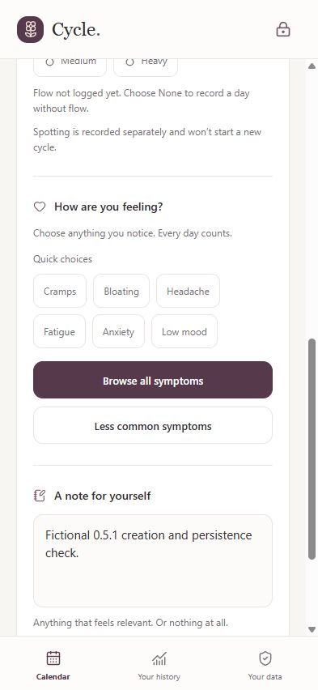

## 0.4.0 owner report — October 9, 2026

The owner reported “Symptoms work well, visibility is good, and biometric is working.” This records a functional pass for those features in preview **0.4.0**, using the established Pixel 7 / Android 17 context. The report did not enumerate individual cancellation, import, accessibility, or other edge cases. Flip5 and iOS hardware validation remain pending. Earlier pending-device statements below describe the state when those checks were recorded.

## 0.5.0 calendar and visual history — October 9, 2026

Implemented year/month/day navigation, recorded cycle-day labels, cycle-length and bleeding-duration charts, all-history statistics, and chronological flow strips. Explicit no-flow observations are now separate from missing logs. Old positive-flow/spotting entries retain their observations; old default None values remain unknown. Vault envelope, passphrase, and biometric key are unchanged. CSV adds a final `Flow recorded` column.

- `pnpm check`: TypeScript and all **35 tests** passed. Seven new tests cover explicit None/clear-flow behavior, old journal migration and invalid flags, chronological run boundaries, long gaps/leap dates, actual-start cycle-day lookup, statistics with incomplete values and bounded end markers, and encrypted restore/CSV retention of the new distinction.
- Web, Android Hermes, and iOS Hermes production exports passed, including a rebuild after clarifying no-flow labels. TypeScript was checked after the final copy changes. Prettier and Git whitespace checks passed. The iOS result is a bundle check, not an IPA or device test.
- Browser checks used isolated `127.0.0.1:4174` and fictional data at 393 × 852 and 1280 × 720. Inspected mobile charts, annual tiles, desktop charts, desktop calendar/editor, and empty-history states. Sample cycle lengths were 30 and 29 days (average 29.5); the latest length remained incomplete. All three sample bleeding spans were 5 days.
- Verified year-month drilldown leaves the selected date unchanged, switching to Day view restores that selection, Today returns to today, invalid `2026-02-29` is rejected, and stepping forward from `2024-02-29` reaches March 1. Mobile month cells open the daily sheet. History-row buttons open the starting date in Day view. The symptom browser returns to the daily editor in that view.
- The previous fictional encrypted journal opened with its existing passphrase, three symptoms, and note intact. Its legacy default None correctly appeared as flow not logged. Explicit None survived lock/reload/unlock; clearing flow retained all symptoms and the note. Encrypted backup restore and CSV semantics were checked in automated tests; native file sharing/restore remain hardware checks.
- No captured browser console errors. The fictional vault was locked, sample mode exited, the test tab closed, viewport reset, and isolated preview server stopped. User storage on port 4173 was not used for these checks.
- Native update retention, biometrics, keyboard, TalkBack, large text, fold transitions, and offline restart need the [0.5.0 hardware checklist](android-testing.md#050-calendar-and-history-checks). No device pass is claimed for 0.5.0.

The signed ARM64 release APK built successfully. Signature and 16 KB zip-alignment verification passed; its signing certificate matches previous previews. Package identity is `com.liambic.cycletracker.preview`, version **0.5.0**, version code **5**, minimum API 24, target API 36, `USE_BIOMETRIC`, `allowBackup: false`, and no debuggable flag. The bundled Hermes program is 3,115,660 bytes.

- File: `artifacts/android/cycle-tracker-preview-0.5.0-arm64-v8a.apk` (29,920,070 bytes; excluded from Git).
- APK SHA-256: `222f7c6cf1c917278024bd8fa4064446f0a2566ae688c2bfcc0d2b4be956fd26`.
- Signing certificate SHA-256: `6e64159ed7656a5873b6f0379e74ef1c0a8bd6b1bbaba12e51cbd26355f75576`.

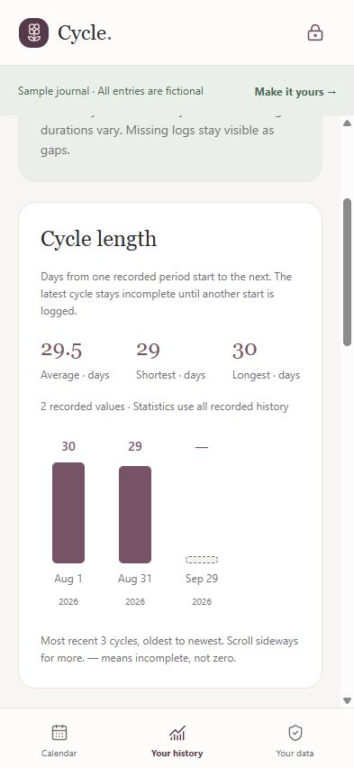

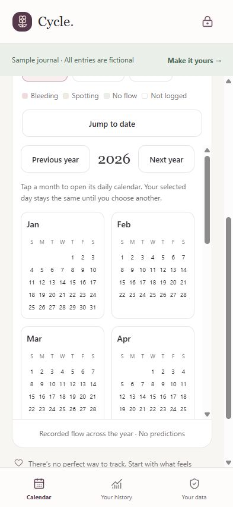

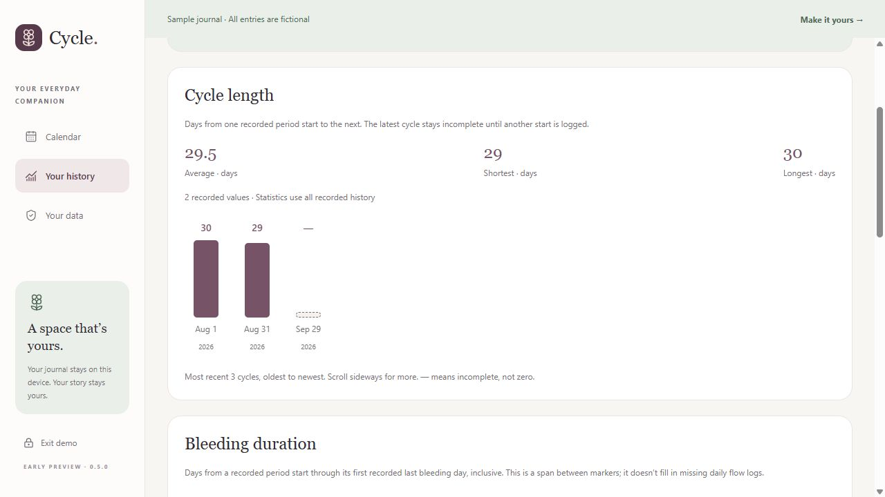

## 0.4.0 symptom catalog and preferences — October 9, 2026

Implemented 99 curated symptoms covering the source's four reference lists, category/search browsing, a less-common browser, selected-symptom summaries, quick choices, and an encrypted perimenopause visibility preference. All 30 original labels remain supported. Existing custom labels are retained when they overlap additions to the catalog. The preference defaults on for older backups; vault format, passphrase, and biometric key are unchanged.

- `pnpm check`: TypeScript and all **28 tests** passed. Six new tests cover old catalog labels, search/category visibility, case-insensitive custom collisions, older journal imports and malformed preferences, encrypted preference/entry round-trip with CSV retention, and selection limits without partial custom additions.
- Web, Android Hermes, and iOS Hermes production exports passed. TypeScript and the production exports were repeated after a browser accessibility correction; checkbox state and button pressed state are now explicitly exposed on web. Prettier and Git whitespace checks passed.
- Browser checks used the isolated `127.0.0.1:4174` test origin with fictional data. The previous preview's journal opened with its passphrase and original note intact. Logged Hot flashes, Itchy ears, and a custom fictional symptom; the selected-day summary retained all three and the note after locking/reloading/unlocking.
- Turning off perimenopause choices survived lock/reload/unlock, removed the curated category and its search results, and left the existing Hot flashes entry visible in the daily summary. Turning it on restored the category. Sample mode's visibility change disappeared after exiting/re-entering sample mode.
- Visually checked the symptom browser at 393 × 852 and 1280 × 720. Confirmed scoped uncommon-symptom search, custom creation, empty search feedback, separate migraine-with/without-aura results, and checkbox checked/pressed states in the browser accessibility tree. No captured console errors. The test session was locked, its tab closed, the viewport restored, and the isolated preview server stopped.
- Encrypted restore and CSV retention for hidden symptoms were exercised in automated tests. Native keyboard, Android Back, TalkBack, large text, fold transitions, native backup sharing/restore, and biometric regression still require the [0.4.0 hardware checklist](android-testing.md#040-symptom-browser-checks). No owner device pass is claimed for this build.

The signed ARM64 release APK built successfully. APK signature and 16 KB zip-alignment verification passed; the certificate matches previous previews. Package identity is `com.liambic.cycletracker.preview`, version **0.4.0**, version code **4**, minimum API 24, target API 36, `allowBackup: false`, and no debuggable flag. The bundled Hermes program is 3,104,148 bytes.

- File: `artifacts/android/cycle-tracker-preview-0.4.0-arm64-v8a.apk` (29,908,558 bytes; excluded from Git).
- APK SHA-256: `88fb090ca31d1833b6ff9b8cc73bcfce7f373624e7b3a95f76f7c18e22e0260e`.
- Signing certificate SHA-256: `6e64159ed7656a5873b6f0379e74ef1c0a8bd6b1bbaba12e51cbd26355f75576`.

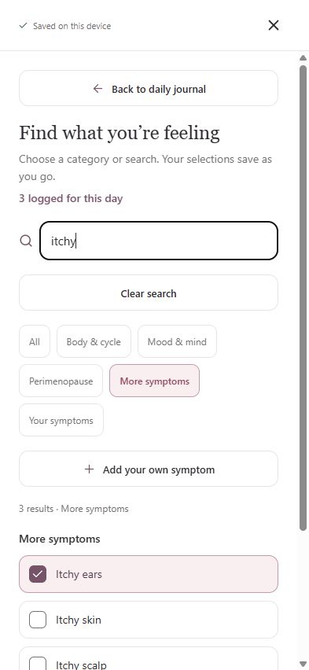

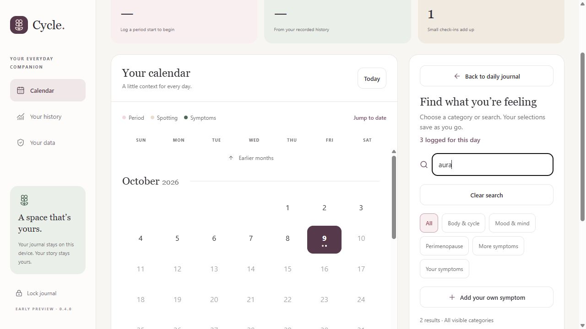

## 0.3.0 owner biometric report — October 9, 2026

The owner reported “Verified biometrics are functioning as expected.” This records a functional biometric pass for preview **0.3.0** in the established Pixel 7 / Android 17 test context. The report did not enumerate cancellation, changed enrollment, background races, restore/deletion, or other individual checklist results; those are not independently marked passed. Flip5 and iOS hardware validation remain pending. Earlier pending-device statements below describe the state when those checks were recorded.

## 0.3.0 biometric unlock — October 9, 2026

Implemented optional native biometric unlock, explicit opt-in/disable controls, authenticated OS key storage, passphrase fallback, and credential cleanup during journal creation, restore, and deletion. The portable encrypted-vault format is unchanged.

- TypeScript and all **22** tests passed. Nine new tests cover biometric round-trip and separation of key material from ordinary storage; cancellation/retry; missing or invalidated credentials with passphrase recovery; absent/malformed/mismatched references; stale/tampered protected keys; unsupported devices and canceled setup; persistence/cleanup failures; orphan cleanup without removing the journal; and key-based vault authentication.
- These biometric tests use a mocked protected-storage interface. They exercise the app's key-handling and recovery logic, not a physical biometric sensor or native prompt.
- Web, Android Hermes, and iOS Hermes production exports passed. Prettier and Git whitespace checks passed. The installed Expo dependency map reports compatible packages in offline mode; no fresh remote dependency audit was performed.
- Browser regression on the isolated `127.0.0.1:4174` origin confirmed a wrong passphrase stays locked and the existing fictional 0.2.0 journal still opens with its correct passphrase and note intact. Browser unlock remains passphrase-only. Settings were visually checked at 393 × 852 and 1280 × 720; no captured console errors. The test journal was locked, the test tab closed, and the viewport reset afterward.
- Native source/configuration checks confirm `SecureStoreModule` registration, authenticated reads/writes using a dedicated service, the iOS Face ID usage message, `USE_BIOMETRIC`, and Android backup rules excluding SecureStore. Native enrollment/prompt behavior, cancellation, app-background races, disabling, and restore/delete cleanup need the 0.3.0 hardware checklist.
- A standalone ARM64 release APK built successfully. Signature verification and 16 KB zip alignment passed. Package identity remains `com.liambic.cycletracker.preview`, version `0.3.0`, version code `3`, minimum API 24, target API 36, `allowBackup: false`, and no debuggable flag. The bundled Hermes program is 3,093,676 bytes. The signing certificate matches earlier previews, supporting installation as an update.

File: `artifacts/android/cycle-tracker-preview-0.3.0-arm64-v8a.apk` (29,898,086 bytes; excluded from Git).

APK SHA-256: `0d3fa4a24975e84d36fc258b450bf4588a65ed2c9205617b88e19b66eb152f6d`.

Signing certificate SHA-256: `6e64159ed7656a5873b6f0379e74ef1c0a8bd6b1bbaba12e51cbd26355f75576`.

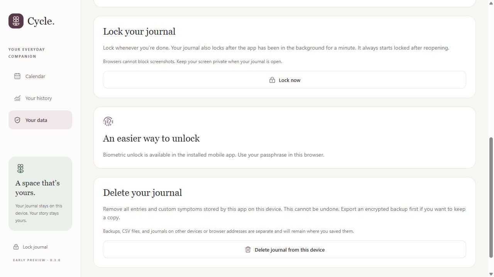

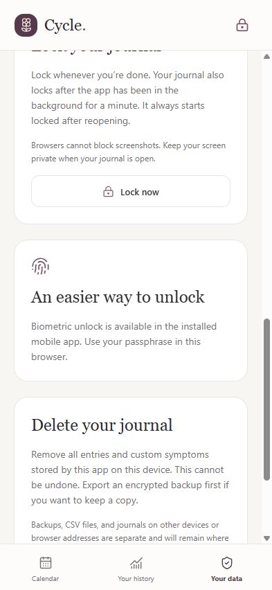

## 0.2.0 owner test result — October 9, 2026

After receiving the 0.2.0 APK and its device regression checklist, the owner reported “Testing complete, all pass.” This is recorded as a pass for 0.2.0 in the established Pixel 7 / Android 17 test context. No additional device or timing measurements were supplied. Flip5 validation remains pending; this report does not establish iOS validation or an independent security audit.

## Pixel 7 owner report — October 9, 2026

The owner reported “Testing passed on Pixel 7” and confirmed Android **17**. This records the overall functional pass of preview **0.1.0**. Individual checklist results, timings, and security/accessibility findings were not supplied. Galaxy Z Flip5 testing remains pending. Earlier pending-device statements below describe the state at the time those historical checks were recorded.

## 0.2.0 privacy and data controls — October 9, 2026

Implemented daily entry deletion with session-only Undo, typed confirmation for deleting the local journal, and native screen capture/app-switcher protection. The vault format and passphrase remain compatible with 0.1.0.

- `pnpm check`: TypeScript and all 13 domain/storage tests passed. New tests cover complete entry restoration and history recalculation, preserving newer edits, draining pending saves before deletion, rejecting late writes, preserving unrelated storage, and recovery after failed writes/deletion.
- Web, Android Hermes, and iOS Hermes production exports passed. iOS export is a bundle check, not an IPA build or device test.
- Prettier formatting and Git whitespace checks passed.
- Browser checks used a separate origin (`127.0.0.1:4174`) with fictional data, leaving the user's existing preview storage separate. Inspected the entry confirmation/cancel flow and data controls at phone width (393 × 852) and desktop width (1280 × 720).
- Verified that whole-journal deletion is disabled in sample mode; its final button requires exactly `DELETE`, rejects lowercase input, and can be canceled. The final destructive browser action was not exercised; actual storage removal and failure paths were covered by automated tests with in-memory storage.
- A fictional note remained after cancellation and survived lock, reload, and unlock. The inspected browser reported no captured console errors; viewport overrides were reset after testing.
- Native source inspection confirms the screen-capture module is registered and React Native's Android modal inherits `FLAG_SECURE`. Actual screenshot blocking, Recents privacy, update-in-place data retention, deletion/Undo, and backup recovery still need a 0.2.0 device regression pass. The earlier Pixel 7 pass applies to 0.1.0.

The standalone ARM64 APK built successfully with the existing local toolchain. Package checks confirm `com.liambic.cycletracker.preview`, version `0.2.0`, version code `2`, minimum API 24, target API 36, `allowBackup: false`, no debuggable flag, and a bundled Hermes program (3,071,732 bytes). APK signature and 16 KB zip-alignment verification passed. The preview signing certificate is unchanged from 0.1.0, supporting an update over the existing installation.

- File: `artifacts/android/cycle-tracker-preview-0.2.0-arm64-v8a.apk` (29,719,786 bytes; excluded from Git).
- APK SHA-256: `3624c4b7bf44304b5c5dd21a8f1a41982466e9dacd722b482dfb2faf713a69ed`.
- Signing certificate SHA-256: `6e64159ed7656a5873b6f0379e74ef1c0a8bd6b1bbaba12e51cbd26355f75576`.

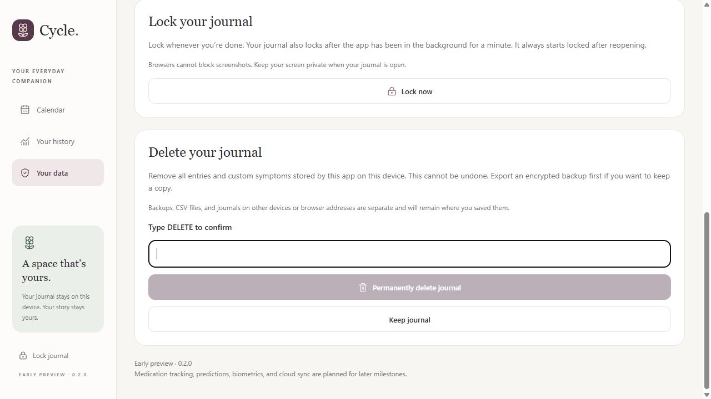

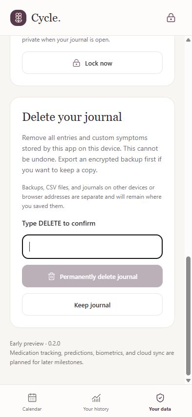

## 0.1 preview — October 8, 2026

This record separates executed checks from work still needing hardware or account access. Test journal entries are fictional.

### Automated checks passed

- Strict TypeScript compilation.
- Frozen dependency installation, Expo dependency compatibility check, and Prettier formatting check.
- Nine domain and storage tests: calendar boundaries/leap days/DST; spotting versus period starts; explicit bleeding duration; removing start markers and cramp severity; malformed journal imports; CSV formula escaping; authenticated encryption round-trip, random nonces, wrong passphrase and tampering rejection; envelope/KDF validation; ordered writes and recovery after a failed write.
- Expo web production JavaScript export.
- Android and iOS Hermes production bundle generation. These are bundle checks, not installable app builds or device execution.

### Browser checks performed

- Sample mode opens with clearly labeled fictional data.
- A new test vault can be created with a passphrase.
- Flow, period-start marker, cramp rating, and a note save and survive a reload/lock/unlock cycle.
- An incorrect passphrase leaves the vault locked with an error.
- An encrypted backup downloads and is accepted by the restore flow.
- Restoring the test backup recovers the note, flow, and cramp rating.
- Calendar, full-screen daily editor, and history screen were inspected at 393 × 852 CSS pixels.
- Desktop calendar and inline daily editor were inspected at 1280 × 720 CSS pixels.
- Loading earlier months shows the newly added months; Today returns to the current month.
- The production app reloads and sample mode opens with the local preview server stopped, using its cached offline shell.
- A second tab cannot unlock a journal already open in another tab, preventing competing snapshot writes.
- The production browser preview reports no captured console errors in the final check.

### Still to validate

- An actual Android APK on Pixel 7 and Galaxy Z Flip5, including installed OS versions, fold/reopen behavior, keyboard, font scaling, background locking, file sharing, and cryptographic performance.
- Native iOS build and device behavior.
- Screen-reader navigation, browser compatibility beyond the current embedded Chromium browser, and a full accessibility review.
- OS backup policies and native task-switcher screenshot protection.
- Independent security review before real health records or public release.

### Known preview limits

The journal is a single encrypted snapshot with an 8 MB import/export limit. There is no sync, medication scheduling, notification delivery, prediction engine, full symptom catalog, PDF report, change-passphrase flow, biometric unlock, or in-app deletion flow yet. A browser vault is tied to the exact origin, so changing hostname or port requires backup/restore. Do not use this preview as the only copy of health records.

## Setup layout correction — October 8, 2026

The first-run setup card collapsed to 62 pixels wide in the browser because `flex: 0` set its flex basis to zero, overriding the intended 390-pixel width. Removed that shorthand, kept the card from shrinking, and allowed the stacked introduction to retain its content height. Feature labels and the privacy caption can wrap on narrow screens.

Verified the rebuilt production setup screen at the user's 1102 × 884 viewport, at the 900-pixel desktop breakpoint, and at 393 × 852 for phones. The desktop card measures 390 pixels wide, the mobile card fits its available width, and the breakpoint check found no horizontal content overflow. TypeScript and the web production build passed. The normal browser viewport was restored after checking.

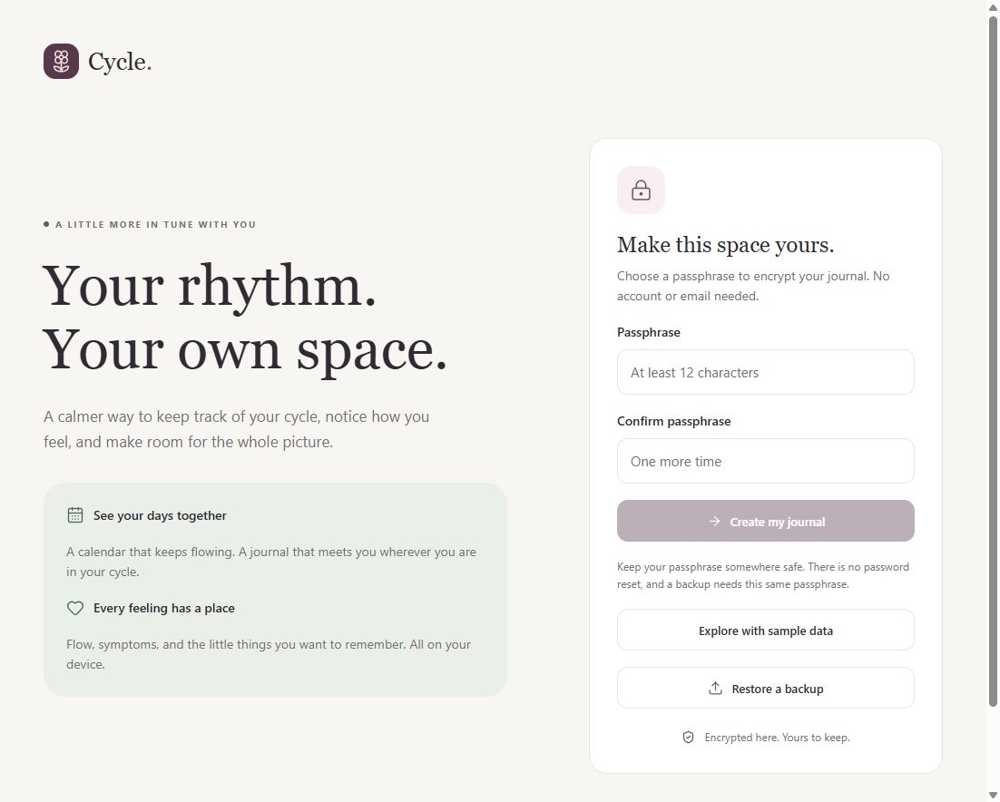

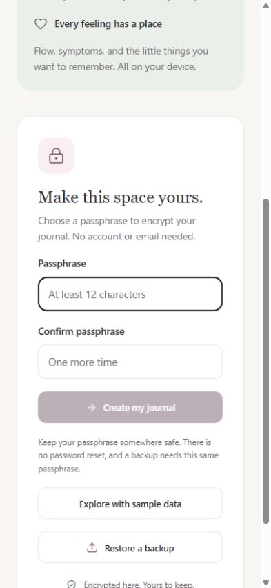

## First Android APK — October 8, 2026

Built a standalone release-mode APK locally with Gradle 9.3.1, JDK 22, Android build tools 36.0.0, and NDK 27.1.12297006. The short build cache and pnpm's hoisted dependency configuration resolve the Windows native compiler path limits encountered during setup.

- File: `artifacts/android/cycle-tracker-preview-0.1.0-arm64-v8a.apk` (29,703,354 bytes; generated locally, excluded from Git).
- App label: **Cycle Tracker Preview**.
- Package: `com.liambic.cycletracker.preview`; version `0.1.0`, version code `1`.
- Minimum Android API 24; target API 36; native architecture `arm64-v8a`.
- `apksigner verify --verbose --print-certs` passed with the private preview certificate (RSA 3072, APK Signature Scheme v2).
- `zipalign -c -P 16 4` passed.
- APK contains its bundled Hermes JavaScript (`assets/index.android.bundle`, 3,055,376 bytes) and native libraries. It is a standalone build, with no development server required.
- Package inspection reports no `application-debuggable` flag. Expo configuration preserves `allowBackup: false` and keeps preview/store identifiers separate.
- `pnpm check` passed TypeScript and all nine existing tests; `pnpm format:check` passed after the dependency-layout correction.
- Git ignore checks exclude the signing key, credential file, and generated APK.

APK SHA-256: `267a27c00618c312e0a5cd553401561f8a44ae26b05473a7b8fcb0a37350f46e`.

Preview signing certificate SHA-256: `6e64159ed7656a5873b6f0379e74ef1c0a8bd6b1bbaba12e51cbd26355f75576`.

No physical phone or configured emulator was connected, so successful compilation and package checks do **not** establish native runtime behavior. Pixel 7/Flip5 installation, keyboard/folding behavior, passphrase performance, backup sharing, and background privacy remain to be exercised with fictional data using [the test guide](android-testing.md).
