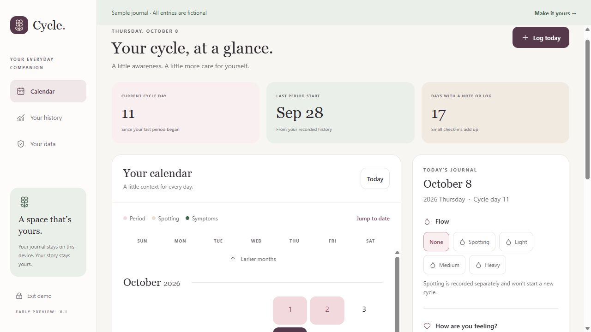

# Validation record

## 0.1 preview — October 8, 2026

This record separates executed checks from work still needing hardware or account access. Test journal entries are fictional.

### Automated checks passed

- Strict TypeScript compilation.
- Frozen dependency installation, Expo dependency compatibility check, and Prettier formatting check.
- Nine domain and storage tests: calendar boundaries/leap days/DST; spotting versus period starts; explicit bleeding duration; removing start markers and cramp severity; malformed journal imports; CSV formula escaping; authenticated encryption round-trip, random nonces, wrong passphrase and tampering rejection; envelope/KDF validation; ordered writes and recovery after a failed write.
- Expo web production JavaScript export.
- Android and iOS Hermes production bundle generation. These are bundle checks, not installable app builds or device execution.

### Browser checks performed

- Sample mode opens with clearly labeled fictional data.
- A new test vault can be created with a passphrase.
- Flow, period-start marker, cramp rating, and a note save and survive a reload/lock/unlock cycle.
- An incorrect passphrase leaves the vault locked with an error.
- An encrypted backup downloads and is accepted by the restore flow.
- Restoring the test backup recovers the note, flow, and cramp rating.
- Calendar, full-screen daily editor, and history screen were inspected at 393 × 852 CSS pixels.
- Desktop calendar and inline daily editor were inspected at 1280 × 720 CSS pixels.
- Loading earlier months shows the newly added months; Today returns to the current month.
- The production app reloads and sample mode opens with the local preview server stopped, using its cached offline shell.
- A second tab cannot unlock a journal already open in another tab, preventing competing snapshot writes.
- The production browser preview reports no captured console errors in the final check.

### Still to validate

- An actual Android APK on Pixel 7 and Galaxy Z Flip5, including installed OS versions, fold/reopen behavior, keyboard, font scaling, background locking, file sharing, and cryptographic performance.
- Native iOS build and device behavior.
- Screen-reader navigation, browser compatibility beyond the current embedded Chromium browser, and a full accessibility review.
- OS backup policies and native task-switcher screenshot protection.
- Independent security review before real health records or public release.

### Known preview limits

The journal is a single encrypted snapshot with an 8 MB import/export limit. There is no sync, medication scheduling, notification delivery, prediction engine, full symptom catalog, PDF report, change-passphrase flow, biometric unlock, or in-app deletion flow yet. A browser vault is tied to the exact origin, so changing hostname or port requires backup/restore. Do not use this preview as the only copy of health records.
